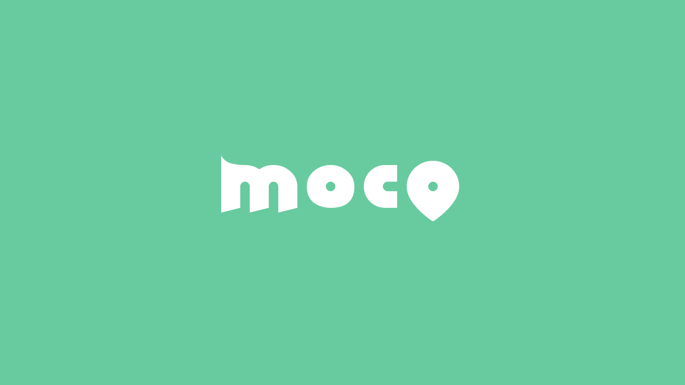

# 📍MOCO : 위치 기반 모각코 서비스

- 배포 URL : https://locomoco.kro.kr/

 

## 프로젝트 소개

- MOCO는 모여서 각자 코딩을 하는 사람들에게 만남의 기회를 가질 수 있도록 하는 프로젝트 입니다.
- 개발자들, 개발공부를 시작하는 사람들, 스터디를 하는 사람들에게 만남의 기회를 제공합니다.
- 번개 모각코를 통해 빠르게, 일반 모각코를 통해 목적에 맞는 모각코를, 위치기반 모각코로 추천 장소까지 제공받을 수 있습니다.

 

## 백엔드 팀원 구성

|                                                                  **박유진**                                                                   |                                                                **조인수**                                                                |
|:------------------------------------------------------------------------------------------------------------------------------------------:|:-------------------------------------------------------------------------------------------------------------------------------------:|
| [   @eugene225](https://github.com/eugene225) | [   @ZZAMBAs](https://github.com/ZZAMBAs) |

 

## 1. 개발 환경

- 기술스택 : Java17, Spring 3.1.8, Spring WebSocket, MySQL, Redis, MongoDB
- 버전 및 이슈관리 : Github, Github Issues, Github Project
- 협업 툴 : Notion, Slack, Swagger
- 서비스 배포 환경 : AWS EC2

 

## 2. 채택한 개발 기술과 브랜치 전략

#### Spring WebSocket + STOMP : 채팅기능 구현
  - 설명

#### Redis : 이미지관리
  - 사용자 프로필 이미지 관리를 위한 활용

#### MongoDB : 채팅 메시지 관리
  - 채팅 메시지 관리를 위한 nosql 도입
  - 채팅방은 MySQL, 메시지 내역만 관리

 

## 3. 역할 분담

### 🍊 박유진

- **기능**
    - 사용자 회원가입, 로그인, 로그아웃 구현
    - Spring WebSocket + STOMP 활용한 채팅 기능 구현
    - 사용자 신고 기능 구현
    - 모각코 좋아요, 좋아요 취소 구현
    - 사용자 프로필 이미지 관리 Redis 도입
    - 채팅 메시지 관리 MongoDB 도입

### 👻 조인수

- **기능**
    - 블라블라

 

## 4. 개발 기간 및 작업 관리

### 개발 기간

- 전체 개발 기간 : 2024-02 ~ 2024-06
- 기획 및 디자인 : 2024-02
- 기능 구현 : 2022-02-17 ~ 2024-06

 

### 작업 관리

- GitHub Projects와 Issues를 사용하여 진행 상황을 공유했습니다.
- Slack Github 봇을 활용하여 슬랙으로 소통하였습니다.
- 주간회의를 진행하며 작업 순서와 방향성에 대한 고민을 나누고 Notion에 회의 내용을 기록했습니다.

 

## 5. 신경 쓴 부분

- 

 

## 6. 페이지별 기능

### [초기화면]
- 내용

| 초기화면             |
|------------------|
|  |

 

## 7. 트러블 슈팅

- [예시](이슈링크)

 

## 8. 프로젝트 후기

### 🍊 박유진

 

### 👻 조인수

 
